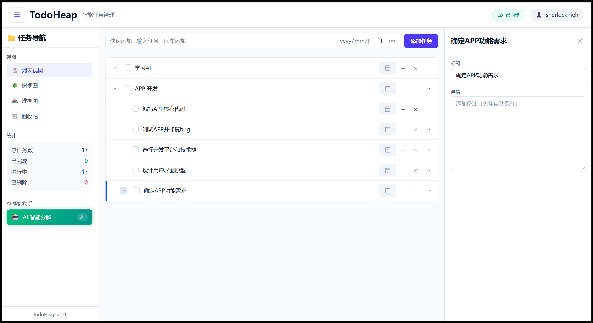

# TodoHeap 任务堆




- **核心功能**: 在 TodoList 上增加 AI 自动分解任务的功能, 减轻任务管理压力;

- **特色功能**: 以思维导图方式展示和管理任务树, 帮助你理清思路;

- **特色功能**: 以堆视图可视化展示最优先的任务, 破解你的选择困难症;


## 快速链接

- **应用首页**: https://sherlocknieh.github.io/TodoHeap/
- **在线文档**: https://sherlocknieh.github.io/TodoHeap/docs/

## 开发指南

### 前端开发

- 安装 Node.js
  ```powershell
  winget install OpenJS.NodeJS
  ```
- 进入前端项目目录
  ```bash
  cd frontend
  ```
- 安装前端项目依赖
  ```bash
  # 使用国内镜像加速下载
  npm config set registry https://registry.npmmirror.com
  # 安装依赖
  npm install
  ```
- 本地调试运行
  ```bash
  npm run dev
  ```


### 后端开发

- 注册登录 [Supabase](https://supabase.com/);
- 联系我获取此项目的管理权限: sherlocknieh@gmail.com
- 在线开发:
    - https://supabase.com/dashboard/project/nxzvisuvwtsnlrugqghx
- 本地开发:
  - 安装supabase-cli:
    ```bash
    npx supabase
    ```
  - 本地编写SQL脚本: supabase/migrations/;
  - 本地编写边缘函数: supabase/functions/;
  - 推送到远程:
    ```bash
    # 登录
    npx supabase login
    # 连接到项目
    npx supabase link --project-ref nxzvisuvwtsnlrugqghx
    # 推送数据库更改
    supabase db push
    # 部署边缘函数
    supabase functions deploy
    ```
  - 参考 [supabase-cli 官方文档](https://supabase.com/docs/reference/cli/supabase-login);
  - 参考 [边缘函数官方教程](https://supabase.com/docs/guides/functions/quickstart);


### 在线文档

- 在 docs/ 下创建和编辑文档;
- 推送到 GitHub 后会自动部署为在线文档;
- requirements.txt 是自动构建所需的依赖, 请勿删除;

### 提交指南

1. 先到 Issue 页面查看/创建/认领任务: https://github.com/sherlocknieh/TodoHeap/issues

2. 本地创建新分支并开始工作:
   ```bash
   git checkout -b <分支名>
   ```

3. 发布分支后到仓库分支页面提 Pull Request:
   https://github.com/sherlocknieh/TodoHeap/branches/yours

4. 代码被合并后可删除分支;
