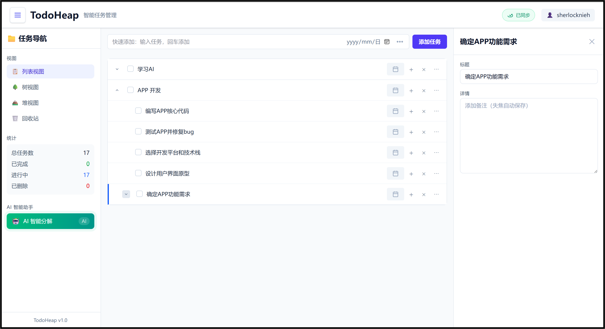

# TodoHeap 任务堆


## 快速链接

- **应用首页**: https://sherlocknieh.github.io/TodoHeap/
- **在线文档**: https://sherlocknieh.github.io/TodoHeap/docs/zh/


## 项目简介




- **核心功能**: 在传统 TodoList 上增加 AI 任务分解的功能, 减轻人脑在任务管理上耗费的精力;

- **特色功能**: 以思维导图方式展示和管理任务树, 帮助你高效地整理思路;

- **特色功能**: 以堆视图可视化展示最优先的任务, 破解你的选择困难症;

## 项目目标

- 本项目的终极目标: 
  - 解决现代人类由于多任务压力造成的拖延, 焦虑, 失眠问题;
- 核心思路: 
  - 用AI接管多任务管理的复杂性, 让用户能更专注于任务执行本身;
- 终极效果: 
  - 输入过程: 用户只需用自然语言输入任务, 等待系统自动整理优化和安排, 本人极少需要介入任务管理过程;
  - 执行过程: 用户只需每天按系统推荐的优先级顺序消除当日任务, 夜间即可不受未完成感的困扰, 安然入睡;
- 由于输入过程只需一股脑地把任务扔进堆里, 执行过程只需无脑地从堆顶取任务, 因此取名为 TodoHeap 任务堆;


## 开发指南

### 依赖环境

```powershell
# 安装 Node.js（建议 16+ 或 18+ LTS）
# 访问官网 https://nodejs.org/ 下载并安装，或使用系统包管理器
# Windows 可用 winget 安装：
winget install OpenJS.NodeJS

# 推荐使用 pnpm 管理依赖（也支持 npm/yarn）
npm install -g pnpm

# （可选）配置国内镜像以加速依赖下载：
npm config set registry https://registry.npmmirror.com
```


### 前端开发

- 以 `frontend` 为工作目录
- 开发指南: [frontend/README.md](frontend/README.md)

快速运行（开发）：

```bash
cd frontend
pnpm install
pnpm dev
```

如果使用 `npm`：

```bash
cd frontend
npm install
npm run dev
```

本地开发需要在 `frontend` 中配置环境变量文件 `.env.local`，示例位于 `frontend/README.md`。

### 文档开发

- 以 `docs` 为工作目录
- 开发指南: [docs/README.md](docs/README.md)

快速预览文档（使用 VitePress）：

```bash
cd docs
pnpm install
pnpm dev
# 打开浏览器访问 http://localhost:5173
```

### 前端和文档联合开发

- 在项目根目录可以同时启动前端与文档（需分别在各目录安装依赖）：

```bash
# 启动前端（新终端）
cd frontend && pnpm dev

# 启动文档（新终端）
cd docs && pnpm dev
```


### 后端开发

#### 在线/远程 Supabase

- 项目托管在 Supabase（限定访问），如需管理权限请使用项目维护者提供的联系方式。

#### 本地 Supabase 开发

- 使用 Supabase CLI 进行本地或远程项目管理。示例：

```bash
# 登录到 Supabase（交互式）
npx supabase login

# 将本地仓库与 Supabase 项目关联（会有交互提示）
npx supabase link

# 创建数据库迁移
npx supabase migration new your_migration_name

# 将本地迁移推送到项目（谨慎操作）
npx supabase db push
```

边缘函数（Edge Functions）开发示例：

```bash
# 新建函数
npx supabase functions new my-function

# 部署函数
npx supabase functions deploy my-function
```

注意：操作 Supabase CLI 可能需要你具有相应项目的权限和访问密钥，请向项目维护者获取。

### 提交指南

1. 到 Issue 页面查看/创建/认领任务。
2. Fork 项目到自己的仓库并创建新分支开始开发。
3. 完成开发后提交 PR（Pull Request）并填写变更说明。
4. 代码合并后可删除分支并关闭对应 Issue。
