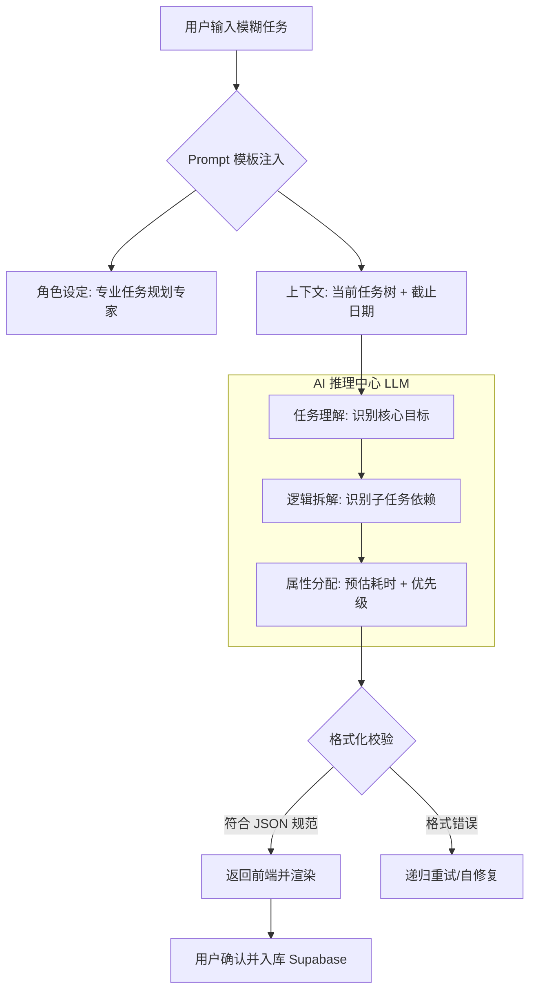

# 公式显示

## 块级公式
$$
E = mc^2
$$

## 行内公式
This is an inline formula: $E = mc^2$.

# Mermaid 图表

```mermaid
graph TD
    A[用户输入模糊任务] --> B{Prompt 模板注入}
    B --> C[角色设定: 专业任务规划专家]
    B --> D[上下文: 当前任务树 + 截止日期]
    
    subgraph AI 推理中心 LLM
        E[任务理解: 识别核心目标] --> F[逻辑拆解: 识别子任务依赖]
        F --> G[属性分配: 预估耗时 + 优先级]
    end
    
    D --> E
    G --> H{格式化校验}
    H -- 符合 JSON 规范 --> I[返回前端并渲染]
    H -- 格式错误 --> J[递归重试/自修复]
    I --> K[用户确认并入库 Supabase]
```
