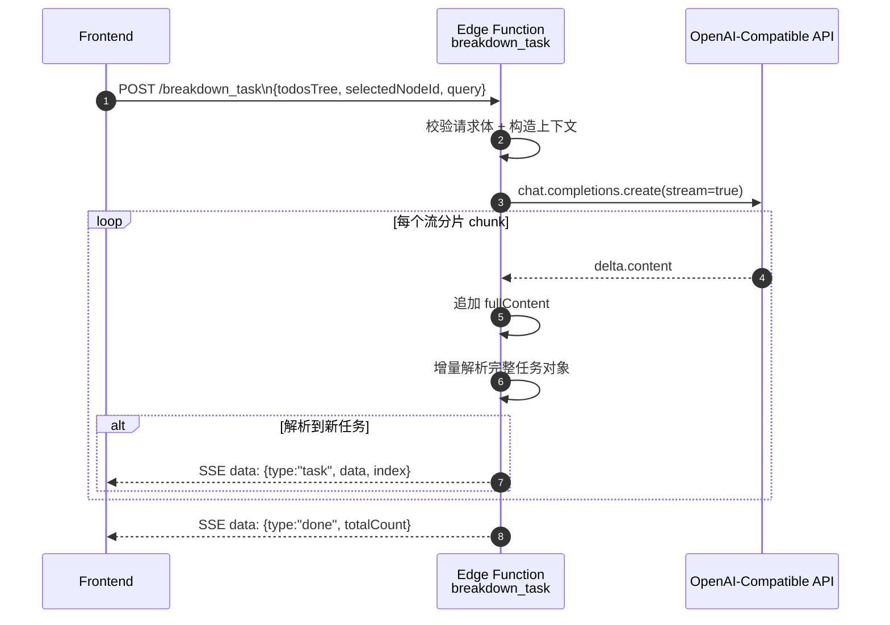
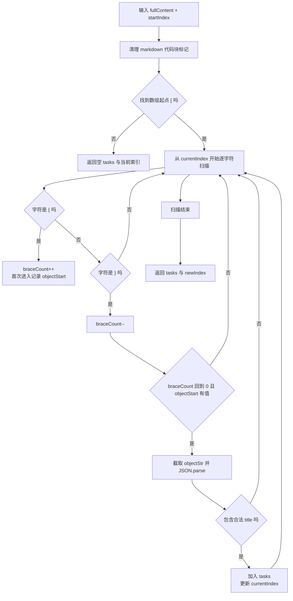

# breakdown_task Edge Function 逻辑梳理

本文档梳理 Supabase Edge Function [supabase/functions/breakdown_task/index.ts](../../../supabase/functions/breakdown_task/index.ts) 的核心流程、输入输出协议与关键实现细节。

## 1. 功能目标

breakdown_task 的职责是：

- 接收前端传入的任务树、目标任务 ID 与用户补充说明。
- 将上下文组织成提示词，调用大模型进行任务分解。
- 以 SSE（Server-Sent Events）流式返回已解析出的子任务，提升前端感知速度。

## 2. 输入与输出

### 2.1 请求体（JSON）

请求体结构（对应 RequestBody）：

- todosTree: treeNode 或 treeNode[]，完整任务树（或根节点数组）
- selectedNodeId: number，待拆解目标任务 ID
- query: string，用户补充说明

任务节点 treeNode 字段：

- id: number
- title: string
- status: todo | doing | done | deleted
- priority: 0 | 1 | 2
- deadline?: string | null
- children?: treeNode[]

### 2.2 响应协议

- 成功：返回 text/event-stream，持续推送 data: { ... }\n\n 消息
- 失败：返回 application/json 的错误对象

SSE 事件数据（type 字段区分）：

- task: 单个已解析任务
- done: 全部完成，包含总条数
- error: 流处理阶段异常

## 3. 主流程分解

### 3.1 预检与请求校验

处理顺序：

1. 若是 OPTIONS，请求直接返回 CORS 头。
2. 读取 JSON 请求体。
3. 校验 body、todosTree、query 是否有效；不通过则返回 400。

### 3.2 任务树上下文构造

函数会构造两段上下文：

- dumpTree(todosTree): 序列化整棵任务树，包含层级、状态、优先级、截止日期。
- getGoalTask(..., selectedNodeId): 提取目标节点，再用 dumpTree 输出目标任务片段。

然后组合消息：

- system: 固定 systemPrompt（约束输出为 JSON 数组）
- system: 当前任务树文本
- system: 目标任务文本
- user: 用户 query

### 3.3 模型调用

- 通过环境变量创建 OpenAI 客户端：
  - OPENAI_API_KEY
  - OPENAI_BASE_URL
- 读取 OPENAI_MODEL，默认 deepseek-chat。
- 调用 chat.completions.create 并启用 stream: true。

### 3.4 流式增量解析与 SSE 推送

循环消费模型流 chunk：

1. 取 delta.content 追加到 fullContent。
2. 调用 tryParseIncrementalTasks(fullContent, lastParsedIndex)。
3. 对本轮新解析出的任务逐条推送 SSE(type=task)。
4. 更新 lastParsedIndex，避免重复解析。
5. 流结束后推送 done 事件并关闭流。
6. 若中途异常，推送 error 事件并关闭流。

## 4. 增量解析器细节（tryParseIncrementalTasks）

该函数不是一次性 JSON.parse 整个响应，而是做“对象级增量提取”：

- 先清理可能出现的 ```json / ``` 包裹。
- 定位数组起点 [。
- 用大括号计数（braceCount）扫描完整对象边界。
- 每找到一个完整 { ... }，尝试 JSON.parse。
- 仅当存在 title 且为字符串时，认定为有效任务。
- 返回本轮 tasks 与 newIndex（下次扫描起点）。

这种实现能在模型尚未输出完整数组时，提前交付可用任务片段。

## 5. Mermaid 图解

### 5.1 端到端时序图



### 5.2 增量解析状态流程图



## 6. 对前端的协议建议

前端处理 SSE 时建议按 type 分支：

- task: 立即追加到子任务列表，实现边生成边展示
- done: 停止 loading，并以 totalCount 校验完整性
- error: 展示错误提示，并允许用户重试

建议同时设置超时与中断能力（AbortController），避免网络异常导致悬挂请求。

## 7. 当前实现注意点

- selectedNodeId 未命中时，不会直接报错；目标任务上下文会退化为空数组文本，可能影响模型输出质量。
- 请求校验覆盖了 body、todosTree、query，但未显式校验 selectedNodeId 的类型与存在性。
- 增量解析目前只强校验 title；description、sort_order、deadline 的合法性依赖模型输出。

## 8. 关键代码定位

- 主处理入口： [supabase/functions/breakdown_task/index.ts](../../../supabase/functions/breakdown_task/index.ts)
- 任务树序列化：dumpTree
- 目标任务提取：getGoalTask
- 客户端初始化：createOpenAIClient
- 增量解析：tryParseIncrementalTasks
