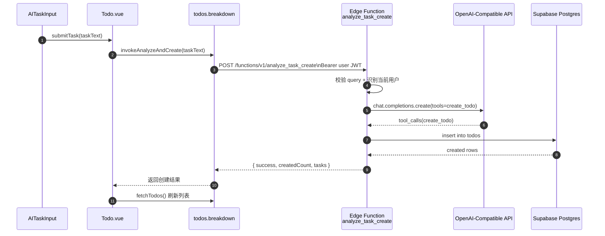

# analyze_task_create 任务分析与直写入库

本文档说明新增的“任务分析”能力：前端发送模糊自然语言描述到 Edge Function，后端调用大模型进行分析整理，并通过工具调用直接写入 `todos` 表。

## 1. 功能目标

- 输入一句模糊任务描述（例如“下周把毕业设计推进起来”）。
- 由模型拆解为可执行任务（1-8 个）。
- 在后端直接入库，避免前端逐条创建。

## 2. 代码位置

- Edge Function: [supabase/functions/analyze_task_create/index.ts](../../../supabase/functions/analyze_task_create/index.ts)
- 前端调用封装: [frontend/src/stores/todos.breakdown.js](../../../frontend/src/stores/todos.breakdown.js)
- 页面接入点: [frontend/src/pages/Todo.vue](../../../frontend/src/pages/Todo.vue)
- 输入组件: [frontend/src/components/AITaskInput.vue](../../../frontend/src/components/AITaskInput.vue)

## 3. 端到端流程



## 4. 接口协议

### 4.1 请求

`POST /functions/v1/analyze_task_create`

Headers:

- `Authorization: Bearer <access_token>`
- `apikey: <publishable_or_anon_key>`
- `Content-Type: application/json`

Body:

```json
{
  "query": "我想把新产品上线准备好",
  "parentId": null
}
```

### 4.2 响应

成功示例：

```json
{
  "success": true,
  "createdCount": 3,
  "tasks": [
    {
      "id": 101,
      "title": "明确上线目标与范围",
      "description": "输出上线目标清单和验收标准",
      "deadline": null,
      "status": "todo",
      "priority": 2,
      "parent_id": null,
      "created_at": "2026-04-17T10:00:00.000Z"
    }
  ]
}
```

失败示例：

```json
{
  "success": false,
  "error": "AI 未生成可写入的任务"
}
```

## 5. 后端实现要点

### 5.1 用户身份与权限

- 通过请求头 `Authorization` 创建 Supabase 客户端。
- 使用 `supabase.auth.getUser()` 获取当前用户。
- 插入时写入 `user_id = 当前用户`，并受 RLS 策略保护。

### 5.2 模型工具调用（Tool Calling）

模型并不直接返回最终任务数组，而是调用 `create_todo` 工具：

- 工具参数：`title`、`description`、`deadline`、`status`、`priority`、`parent_id`
- 服务端解析 tool arguments 后进行清洗和校验
- 执行真实数据库 `insert`
- 把执行结果以 `tool` 消息回传给模型，支持多轮调用

### 5.3 数据清洗策略

- `title`：trim，空值回退为“未命名任务”，最大 200 字符
- `description`：可空，最大 500 字符
- `deadline`：仅接受可解析时间，转 ISO；无效值置 `null`
- `status`：限定为 `todo|doing|done`，默认 `todo`
- `priority`：限制 0-4，默认 1
- `parent_id`：仅当属于当前用户且未删除时才允许使用

## 6. 前端交互变更

- `AITaskInput` 新增 `loading` 属性，分析期间禁用输入并显示“分析中...”。
- `Todo.vue` 监听 `submit-task`，调用 `invokeAnalyzeAndCreate`。
- 成功后调用 `fetchTodos()` 拉取最新数据，统一展示后端真实写入结果。

## 7. 与 breakdown_task 的区别

- `breakdown_task`：返回 SSE 子任务流，前端决定是否写入。
- `analyze_task_create`：后端直接写库，前端只接收结果并刷新。
