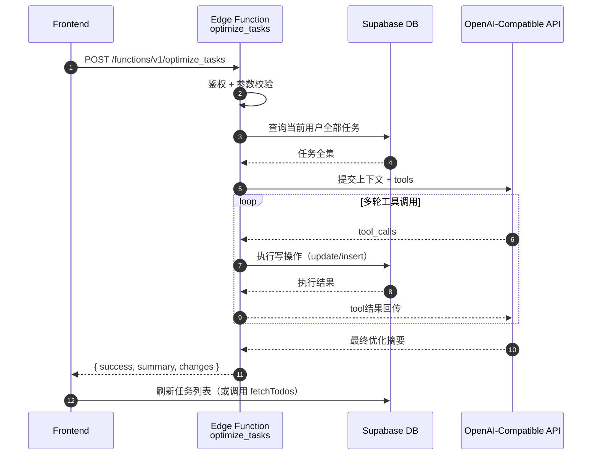
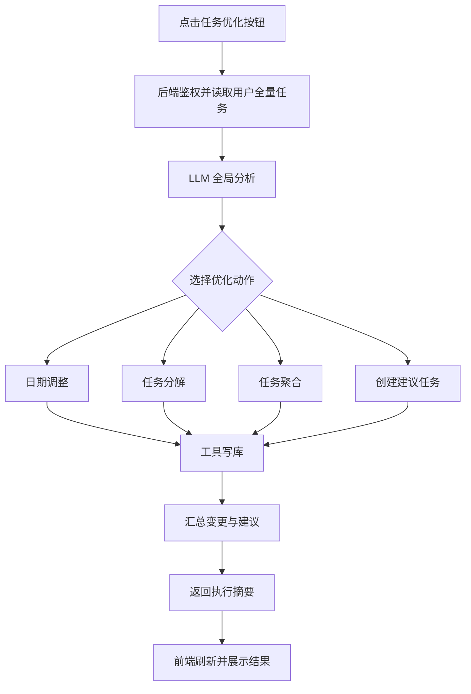

# 任务优化命令设计（文档先行，暂不实现）

本文档定义一个新功能：前端通过按钮触发“任务优化”命令，后端自动读取当前用户全部任务数据，调用大模型分析后生成优化建议，并通过工具调用直接执行优化调整。

当前阶段仅输出方案与协议，不做代码实现。

## 1. 目标与范围

### 1.1 功能目标

- 在任务页面提供一个“任务优化”按钮。
- 用户点击后触发一次后端优化流程。
- 后端自动获取该用户全部任务数据（含层级关系、状态、优先级、日期等）。
- 大模型进行全局分析并输出优化建议。
- 大模型通过工具调用直接执行优化动作（写库）。

### 1.2 本期优化动作（必须覆盖）

- 日期调整：优化任务 deadline / start_date。
- 任务分解：将较大的任务拆解为可执行子任务。
- 任务聚合：将相关任务收拢到同一父任务下（调整 parent_id）。
- 任务建议：创建 1 条新任务，详述执行建议（建议型任务卡片）。

## 2. 用户交互设计

## 2.1 入口

- 页面：Todo 主界面。
- 入口：顶部或侧栏提供“任务优化”按钮。

## 2.2 交互流程

1. 用户点击“任务优化”。
2. 前端发起优化命令请求（仅传命令与可选偏好参数）。
3. 后端异步执行优化。
4. 前端显示处理中状态（按钮 loading + 状态提示）。
5. 后端返回执行摘要（做了哪些调整、创建了哪些任务、建议说明）。
6. 前端刷新任务数据并展示优化结果面板。

## 2.3 安全交互建议

- 首次执行建议弹出确认：说明会自动调整任务结构和日期。
- 支持“仅建议不执行（dry-run）”模式作为后续扩展。

## 3. 后端总体架构

建议新增 Edge Function（命名建议）：`optimize_tasks`。

职责：

- 鉴权并识别用户。
- 全量读取用户任务。
- 组织上下文调用大模型。
- 提供工具集给模型执行任务优化。
- 汇总变更结果并返回。

### 3.1 端到端流程图



## 4. 数据读取策略

后端读取范围建议：

- 当前用户 `todos` 全量（不含 `deleted_at` 非空项）。
- 字段至少包括：
  - `id`, `parent_id`, `title`, `description`
  - `status`, `priority`, `deadline`, `start_date`, `difficulty`
  - `created_at`, `updated_at`

上下文组织建议：

- 提供树结构 + 平铺结构两种视图给模型。
- 限制单次上下文长度（必要时分批摘要）。

## 5. 工具调用设计

模型可调用的后端工具（函数内部实现，不对外暴露）：

- `update_task_schedule`
- `breakdown_task`
- `aggregate_tasks_under_parent`
- `create_recommendation_task`

### 5.1 工具定义与语义

1. `update_task_schedule`
- 作用：调整任务时间计划。
- 入参：`task_id`, `deadline`, `start_date`, `reason`。
- 约束：只允许修改当前用户任务。

2. `breakdown_task`
- 作用：把目标任务拆成多个子任务。
- 入参：`parent_task_id`, `children[]`。
- 约束：子任务数上限建议 10；标题不可空。

3. `aggregate_tasks_under_parent`
- 作用：将若干关联任务归并到同一父任务下。
- 入参：`target_parent_id`, `task_ids[]`, `reason`。
- 约束：防止形成循环父子关系（必须做图校验）。

4. `create_recommendation_task`
- 作用：新增“建议型任务”。
- 入参：`title`, `description`, `deadline?`, `priority?`, `parent_id?`。
- 约束：description 必须详述执行建议。

## 6. 结果返回协议（建议）

```json
{
  "success": true,
  "summary": "已完成 8 项优化：日期调整 3 项、任务分解 2 项、任务聚合 2 项、新增建议任务 1 项",
  "changes": {
    "dateAdjusted": [101, 103, 108],
    "breakdowns": [
      { "parentId": 201, "createdChildIds": [301, 302, 303] }
    ],
    "aggregations": [
      { "targetParentId": 220, "movedTaskIds": [110, 111] }
    ],
    "recommendationTaskId": 401
  },
  "recommendation": {
    "title": "本周执行策略建议",
    "description": "先处理高优先级且低阻塞任务，工作日每天预留 90 分钟推进核心任务。"
  }
}
```

## 7. 规则与约束

- 仅操作当前用户数据（严格依赖 RLS + 服务端再次校验）。
- 默认不改 `done` 状态任务日期，除非用户明确授权。
- 聚合动作必须校验层级合法性，禁止把父节点挂到其子孙节点下。
- 每次优化动作数量设上限（例如最多 30 次写操作），防止过度重排。
- 所有写操作记录变更原因（用于审计与回滚）。

## 8. 异常与回滚策略

建议采用“分步事务 + 变更日志”策略：

- 单次工具调用失败时，记录失败并继续或中断（由策略决定）。
- 聚合/分解类批量写入建议使用事务，保证一致性。
- 记录 `optimization_run_id` 及变更明细，支持后续“撤销本次优化”。

## 9. 与现有能力关系

- 与 `breakdown_task` 的关系：
  - `breakdown_task` 偏“指定目标任务分解”。
  - `optimize_tasks` 偏“全局体检 + 自动执行”。

- 与 `analyze_task_create` 的关系：
  - `analyze_task_create` 偏“新输入转任务”。
  - `optimize_tasks` 偏“已有任务体系重排与增强”。

## 10. 里程碑建议（仅规划）

1. M1：只读分析 + 返回建议（不写库）。
2. M2：开启日期调整与建议任务创建。
3. M3：开启任务分解与任务聚合。
4. M4：补充 dry-run、审计日志与一键回滚。

## 11. Mermaid 领域流程图


